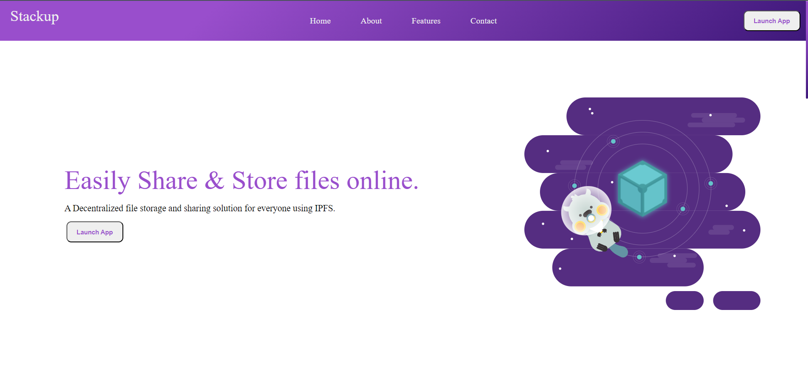

# Stackup

A De-centralized File Storage and sharing solution.

- Upload & View your important documents to and from IPFS via Pinata.
- Share those documents among selected peers and View list of Accounts.
- View images that were shared with you.

## Demo Image

## Workflow:

<ol>
    <li>Uploading to IPFS:
        <ul>
            <li>Step 1: User connects their metamask account to the dapp.</li>
            <li>Step 2: Choose any image by clicking on "choose Image" button.</li>
            <li>Step 3: After choosing an image, the upload button will be enabled.</li>
            <li>Step 4: Sign a transaction and upload the file to ipfs (Pinata).</li>
            <li>Step 5: After successfull upload, you can click on "get data" button and you will be able to see the pictures you uploaded to ipfs.</li>
        </ul>
    </li>
    <li>Sharing images with other users:
        <ul>
            <li>Step 1: The user will be provided with a "share" button. After clicking it user can put the address of the person, whom they want to share the file with.</li>
            <li>Step 2: The user adds the addres and clicks on "Share" button and signs a transaction.</li>
            <li>Step 3: After completing the transaction the user will be able to see the list of addresses the user shared the images with in the "People with access" drop down menu.</li>
            <li>Step 4: Now when the other user wants to check the shared image the user can go to "share data" option and paste the address of the user, who shared the image and click the "get data" button. The image will be visible.</li>
        </ul>
    </li>
</ol>

## Folder Structure:

- contracts: Contains the smart contract for the decentralized application.
- deploy: Contains deploy script for deploying the smart contract.
- test: Contains test sripts for the testing the smart contract.
- src: Contains the front-end application.

## Tools, Languages and Frameworks used

- React JS
- SASS
- Ether JS
- IPFS
- Solidity
- Hardhat
- Alchemy

## Contributions to this repo are WELCOME ⚡👋

- :art: Any improvements to the design and UI are welcome.
- :hammer: try to break the website by testing it to find any bugs. If you find any, check if there is an issue already open for it, if there is none, then report it.

## Steps to be followed in order to make valid contributions to this repo 🍀

**1.** Fork the [StackUp](https://github.com/mrinnnmoy/Stackup) repo by clicking on the fork button on the top of the page. This will create a copy of this repository in your account.

**2.** Clone the forked repository

        git clone "https://github.com/<your-github-username>/Stackup"

- Download and install Node JS v16.16.0
- Download and install Git.
- Go to the terminal of your code editor and run "npm install" to download packages.
- Run "npm run dev" to start a local server.

**3.** Make necessary changes and commit those changes.  
Remember never push anything to the Main branch.  

Always change your branch to "develop" using:

    git checkout develop

Again check your current branch using:

    git branch

It should point \*develop

Now add your changes using:

    git add files-you-edited

If there are multiple files you can use:

    git add .

Now create a commit message using:

    git commit -m "<commit-message-goes-here>"

**4.** Push changes to GitHub

    git push origin develop

**5.** Create a Pull Request 👋 

Now you go to your repository on GitHub, you’ll see a `Compare & pull request` button. Click on that button and now write a summary of what changes you have done.( Attach images if required). I will review your code and merge it if it passes all the tests.❤️
